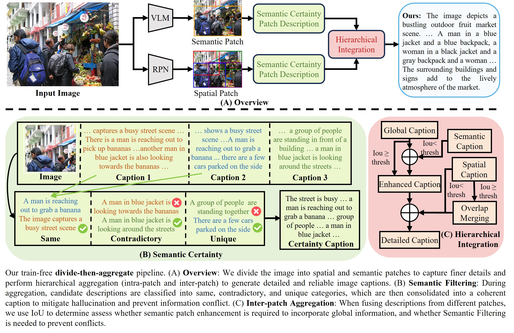

# Code of Patch Matters
This is the official PyTorch implementation of "Patch Matters: Training-free Fine-grained Image Caption Enhancement via Local Perception".

## Paper title:
**Patch Matters: Training-free Fine-grained Image Caption Enhancement via Local Perception** 

## Authors:
**Ruotian Peng†**, **Haiying He†**,**[Yake Wei](https://echo0409.github.io/)**, **[Yandong Wen](https://ydwen.github.io/)** and **[Di Hu](https://dtaoo.github.io/index.html)**

## Abstract:
High-quality image captions play a crucial role in improving the performance of cross-modal applications such as text-to-image generation, text-to-video generation, and text-image retrieval. To generate long-form, high-quality captions, many recent studies have employed multimodal large language models (MLLMs). However, current MLLMs often produce captions that lack fine-grained details or suffer from hallucinations, a challenge that persists in both open-source and closed-source models. Inspired by Feature-Integration theory, which suggests that attention must focus on specific regions to integrate visual information effectively, we propose a **divide-then-aggregate** strategy. Our method first divides the image into semantic and spatial patches to extract fine-grained details, enhancing the model's local perception of the image. These local details are then hierarchically aggregated to generate a comprehensive global description. To address hallucinations and inconsistencies in the generated captions, we apply a semantic-level filtering process during hierarchical aggregation. This training-free pipeline can be applied to both open-source models (LLaVA-1.5, LLaVA-1.6, Mini-Gemini) and closed-source models (Claude-3.5-Sonnet, GPT-4o, GLM-4V-Plus). Extensive experiments demonstrate that our method generates more detailed, reliable captions, advancing multimodal description generation without requiring model retraining.

For more details of our paper, please refer to  our CVPR 2025 [paper](https://arxiv.org/abs/2504.06666).

## Overview of Patch Matters

    
    

## Usage
For divide image into patches, please follow this instruction [divide](https://github.com/GeWu-Lab/Patch-Matters/tree/main/divide) to obtain patch json.

To set up the environment and run our code, please follow these steps:

### 1. Environment Setup
We recommend using Conda to create a dedicated environment:
<pre><code>
conda create -n patch_matters python=3.10
conda activate patch_matters
</code></pre>

### 2. Install Dependencies
Clone the necessary repositories and install the required packages:
<pre><code>
# Install base Llama3 (if not already available or for specific functionalities)
git clone https://github.com/meta-llama/llama3.git
cd llama3
pip install -e .
cd ..

# Clone our Patch-Matters repository
git clone https://github.com/GeWu-Lab/Patch-Matters.git
cd Patch-Matters

# Install required Python packages
pip install -r requirements.txt

# Install ms-swift for specific model support
pip install 'ms-swift[llm]'==2.6.1 
</code></pre>

### 3. Data Preparation

**a. Image Patch Data:**
To divide images into patches and obtain the corresponding JSON files, please follow the instructions in the [divide](https://github.com/GeWu-Lab/Patch-Matters/tree/main/divide) directory. This process will generate the necessary patch information for the aggregation step.

**b. Quick Start with Test Data (for Aggregation):**
To quickly test the aggregation part of our code, we provide a pre-processed test file derived from did-bench. You can find this file in the [test_data](https://github.com/GeWu-Lab/Patch-Matters/tree/main/description_generate/test_data) directory within this repository.
You will also need the corresponding COCO images in [coco](https://github.com/GeWu-Lab/Patch-Matters/tree/main/coco_image/coco_sample_data_Image_Textualization). 

## Run the Code
After setting up the environment and preparing the data, you can run the main parts of our pipeline using the provided shell scripts.

### 1. Generate Descriptions for Patches
This step generates descriptions for the divided image patches.
<pre><code>
bash description_generate/run.sh
</code></pre>

### 2. Aggregate Patch Descriptions
This step aggregates the locally generated patch descriptions into a comprehensive global caption.
<pre><code>
bash aggregation/run.sh
</code></pre>

**Note:** Please ensure that the paths to your data (patch JSON files, COCO images, etc.) and models are correctly configured within the `run.sh` scripts or their underlying Python scripts.

## Citation
If you find this work useful, please consider citing it.

<pre><code>
@article{peng2025patch,
  title={Patch Matters: Training-free Fine-grained Image Caption Enhancement via Local Perception},
  author={Peng, Ruotian and He, Haiying and Wei, Yake and Wen, Yandong and Hu, Di},
  journal={arXiv preprint arXiv:2504.06666},
  year={2025}
}
</code></pre>

